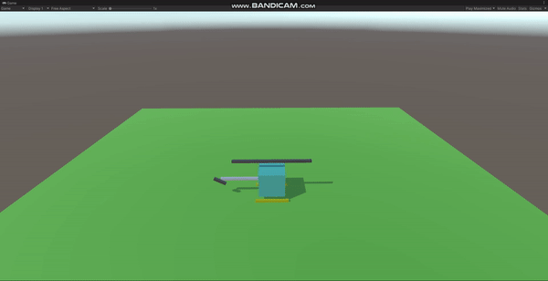

## 헬리콥터 구현하기
1. R키를 누르면 시동을 켜거나 끌 수 있다.
    - 시동을 키면 일정 시간동안 프로펠러가 점점 회전하며, 최대 회전 속도에 다다른다.
    - 시동을 끄면 일정 시간동안 프로펠러가 점점 회전을 멈추며 하강하게 된다.
2. 시동을 키고 프로펠러가 최대 회전 속도에 다다른 상태에서 조종을 할 수 있다.
    - W키를 누르면 상승한다.
    - S키를 누르면 하강한다.
    - A키를 누르면 왼쪽으로 회전한다.
    - D키를 누르면 오른쪽으로 회전한다.

## 결과
