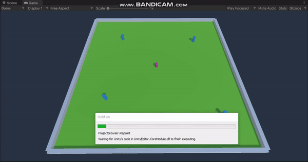

## 자동포탑 구현하기
1. 플레이어는 WASD 키로 이동할 수 있다.
2. 자동포탑은 플레이어를 찾으면 자동으로 조준하여 총알을 쏜다.
    - 자동포탑은 타겟이 없으면 제자리를 돈다.
    - 타겟이 발견하면 타겟이 자동 조준 가능한 범위를 벗어날 때까지 계속 조준한다.
    - 총알은 일정 주기마다 발사된다.
3. 총알이 플레이어와 충돌하면 플레이어의 상태는 False가 된다.

## 결과
